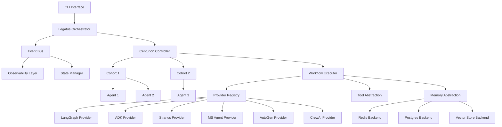
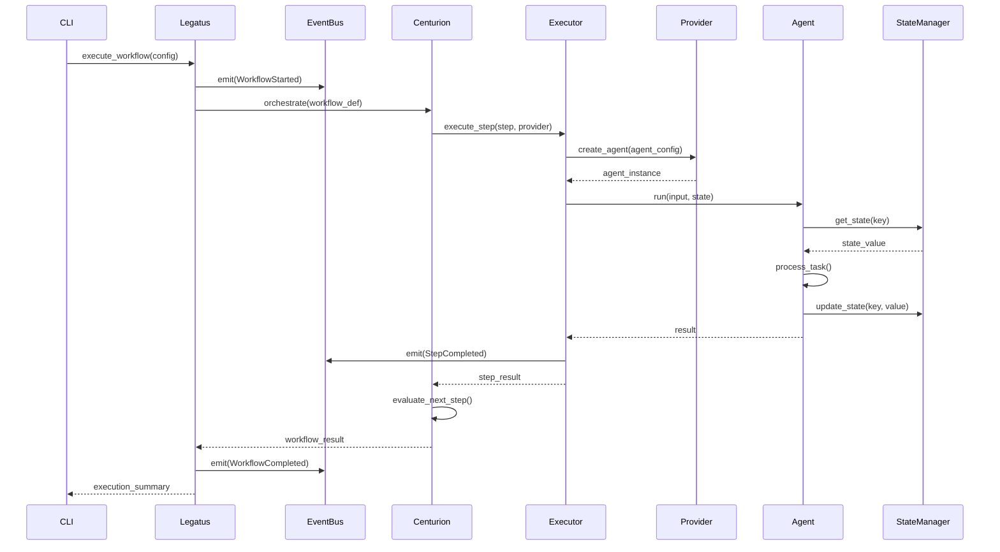
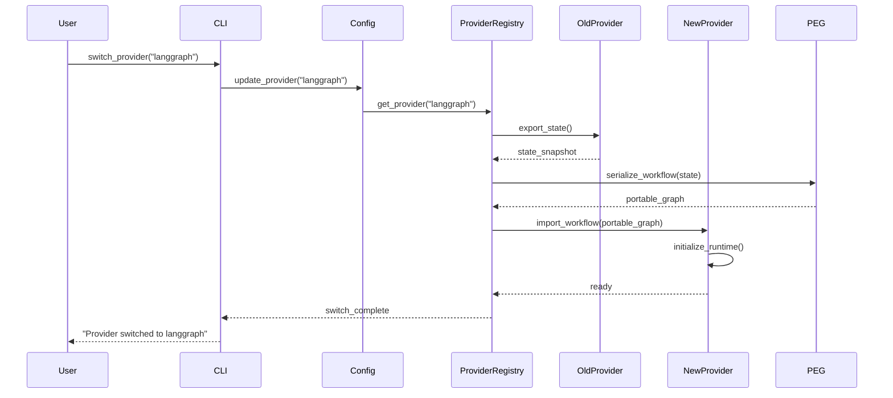
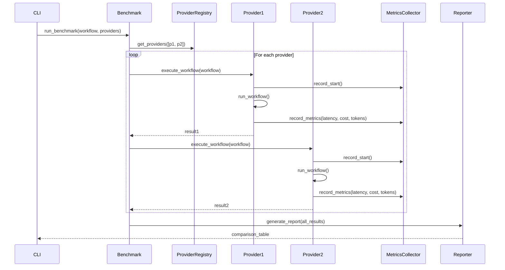
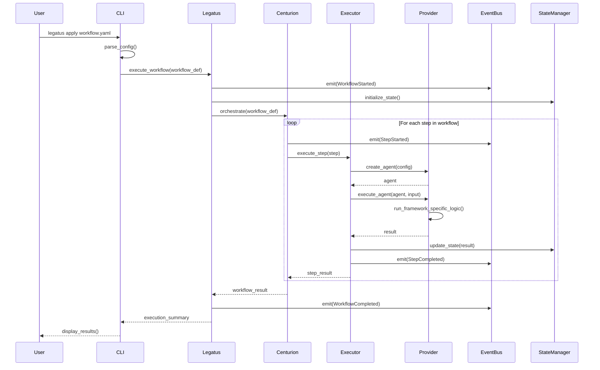

# Design Document: AgentLegatus

## Overview

AgentLegatus is a vendor-agnostic agent framework abstraction layer that enables developers to switch between different AI agent frameworks with a single line of configuration change. Inspired by Terraform's approach to infrastructure abstraction, AgentLegatus provides a unified API across multiple agent frameworks (Microsoft Agent Framework, Google ADK, AWS Strands, LangGraph, AutoGen, CrewAI) while maintaining framework-specific optimizations.

The system implements a Roman military hierarchy architecture (Legatus → Centurion → Cohort → Agent) for orchestrating complex multi-agent workflows. It features an event-driven architecture with a unified event bus, a benchmark engine for cross-framework performance comparison, and comprehensive abstractions for state management, tool invocation, and memory backends.

Target implementation: Python-based framework (~2000 lines core code) with async/await support, minimal dependencies, and production-ready observability through OpenTelemetry integration.

## Architecture




## Sequence Diagrams

### Main Workflow Execution Flow



### Provider Switching Flow



### Benchmark Execution Flow




## Components and Interfaces

### Component 1: Legatus (Orchestrator)

**Purpose**: Top-level orchestrator that manages workflow lifecycle, coordinates Centurions, and handles global event distribution.

**Interface**:
```python
from typing import Dict, Any, Optional, List
from dataclasses import dataclass
from enum import Enum

class WorkflowStatus(Enum):
    PENDING = "pending"
    RUNNING = "running"
    COMPLETED = "completed"
    FAILED = "failed"
    CANCELLED = "cancelled"

@dataclass
class WorkflowResult:
    status: WorkflowStatus
    output: Any
    metrics: Dict[str, Any]
    execution_time: float
    error: Optional[Exception] = None

class Legatus:
    """Top-level orchestrator for multi-agent workflows."""
    
    def __init__(self, config: Dict[str, Any], event_bus: 'EventBus'):
        """Initialize Legatus with configuration and event bus."""
        pass
    
    async def execute_workflow(
        self, 
        workflow_def: 'WorkflowDefinition',
        initial_state: Optional[Dict[str, Any]] = None
    ) -> WorkflowResult:
        """Execute a complete workflow with multiple Centurions."""
        pass
    
    async def add_centurion(self, centurion: 'Centurion') -> None:
        """Register a Centurion controller."""
        pass
    
    async def cancel_workflow(self, workflow_id: str) -> bool:
        """Cancel a running workflow."""
        pass
    
    def get_status(self, workflow_id: str) -> WorkflowStatus:
        """Get current status of a workflow."""
        pass
```

**Responsibilities**:
- Manage workflow lifecycle (start, monitor, cancel)
- Coordinate multiple Centurion controllers
- Emit global workflow events to event bus
- Aggregate results from Centurions
- Handle workflow-level error recovery

### Component 2: Centurion (Workflow Controller)

**Purpose**: Controls execution flow of a workflow segment, manages Cohorts, and implements conditional branching logic.

**Interface**:
```python
from typing import Callable, List, Optional

class ExecutionStrategy(Enum):
    SEQUENTIAL = "sequential"
    PARALLEL = "parallel"
    CONDITIONAL = "conditional"

class Centurion:
    """Workflow controller managing execution flow."""
    
    def __init__(
        self, 
        name: str,
        strategy: ExecutionStrategy,
        event_bus: 'EventBus'
    ):
        """Initialize Centurion with execution strategy."""
        pass
    
    async def orchestrate(
        self,
        workflow_def: 'WorkflowDefinition',
        state: 'StateManager'
    ) -> Dict[str, Any]:
        """Orchestrate workflow execution across Cohorts."""
        pass
    
    async def add_cohort(self, cohort: 'Cohort') -> None:
        """Register a Cohort of agents."""
        pass
    
    async def evaluate_condition(
        self,
        condition: Callable[[Dict[str, Any]], bool],
        state: Dict[str, Any]
    ) -> bool:
        """Evaluate conditional branching logic."""
        pass
    
    async def execute_step(
        self,
        step: 'WorkflowStep',
        executor: 'WorkflowExecutor'
    ) -> Any:
        """Execute a single workflow step."""
        pass
```

**Responsibilities**:
- Execute workflow steps in defined order (sequential/parallel/conditional)
- Manage Cohort lifecycle
- Implement branching and looping logic
- Handle step-level error recovery
- Emit step execution events


### Component 3: Cohort (Agent Group)

**Purpose**: Manages a group of related agents that work together on a specific task domain.

**Interface**:
```python
class CohortStrategy(Enum):
    ROUND_ROBIN = "round_robin"
    LOAD_BALANCED = "load_balanced"
    BROADCAST = "broadcast"
    LEADER_FOLLOWER = "leader_follower"

class Cohort:
    """Group of agents working on related tasks."""
    
    def __init__(
        self,
        name: str,
        strategy: CohortStrategy,
        max_agents: int = 10
    ):
        """Initialize Cohort with coordination strategy."""
        pass
    
    async def add_agent(self, agent: 'Agent') -> None:
        """Add an agent to the cohort."""
        pass
    
    async def remove_agent(self, agent_id: str) -> bool:
        """Remove an agent from the cohort."""
        pass
    
    async def execute_task(
        self,
        task: Dict[str, Any],
        state: 'StateManager'
    ) -> Any:
        """Execute task using cohort strategy."""
        pass
    
    async def broadcast_message(self, message: Dict[str, Any]) -> None:
        """Broadcast message to all agents in cohort."""
        pass
    
    def get_available_agents(self) -> List['Agent']:
        """Get list of available agents."""
        pass
```

**Responsibilities**:
- Manage agent pool and lifecycle
- Implement task distribution strategies
- Handle inter-agent communication
- Monitor agent health and availability
- Load balance tasks across agents

### Component 4: Agent (Worker)

**Purpose**: Individual agent that executes specific tasks using underlying framework capabilities.

**Interface**:
```python
from typing import Protocol

class AgentCapability(Enum):
    TOOL_USE = "tool_use"
    MEMORY = "memory"
    PLANNING = "planning"
    REFLECTION = "reflection"

class Agent:
    """Individual agent worker."""
    
    def __init__(
        self,
        agent_id: str,
        name: str,
        capabilities: List[AgentCapability],
        provider: 'BaseProvider'
    ):
        """Initialize agent with capabilities and provider."""
        pass
    
    async def run(
        self,
        input_data: Any,
        state: Optional[Dict[str, Any]] = None,
        tools: Optional[List['Tool']] = None
    ) -> Any:
        """Execute agent task."""
        pass
    
    async def invoke_tool(
        self,
        tool_name: str,
        tool_input: Dict[str, Any]
    ) -> Any:
        """Invoke a tool through abstraction layer."""
        pass
    
    async def store_memory(
        self,
        key: str,
        value: Any,
        memory_type: str = "short_term"
    ) -> None:
        """Store data in memory backend."""
        pass
    
    async def retrieve_memory(
        self,
        query: str,
        memory_type: str = "short_term",
        limit: int = 10
    ) -> List[Any]:
        """Retrieve data from memory backend."""
        pass
    
    def get_status(self) -> Dict[str, Any]:
        """Get agent status and metrics."""
        pass
```

**Responsibilities**:
- Execute assigned tasks using provider framework
- Invoke tools through abstraction layer
- Manage agent-specific memory
- Report execution metrics
- Handle task-level errors


### Component 5: WorkflowExecutor

**Purpose**: Executes workflow steps using the configured provider, manages execution context, and handles provider-specific runtime.

**Interface**:
```python
class WorkflowExecutor:
    """Executes workflow steps using provider abstraction."""
    
    def __init__(
        self,
        provider: 'BaseProvider',
        state_manager: 'StateManager',
        tool_registry: 'ToolRegistry',
        event_bus: 'EventBus'
    ):
        """Initialize executor with provider and dependencies."""
        pass
    
    async def execute_step(
        self,
        step: 'WorkflowStep',
        context: Dict[str, Any]
    ) -> Any:
        """Execute a single workflow step."""
        pass
    
    async def execute_graph(
        self,
        graph: 'PortableExecutionGraph',
        initial_state: Dict[str, Any]
    ) -> Dict[str, Any]:
        """Execute a complete portable execution graph."""
        pass
    
    def switch_provider(self, new_provider: 'BaseProvider') -> None:
        """Switch to a different provider at runtime."""
        pass
    
    async def checkpoint_state(self, checkpoint_id: str) -> None:
        """Create a state checkpoint for recovery."""
        pass
    
    async def restore_from_checkpoint(self, checkpoint_id: str) -> Dict[str, Any]:
        """Restore execution from a checkpoint."""
        pass
```

**Responsibilities**:
- Execute workflow steps through provider abstraction
- Manage execution context and state
- Handle provider switching
- Implement checkpoint/restore for fault tolerance
- Coordinate tool invocations

### Component 6: BaseProvider (Abstract Provider)

**Purpose**: Abstract base class defining the provider interface that all framework adapters must implement.

**Interface**:
```python
from abc import ABC, abstractmethod

class ProviderCapability(Enum):
    STREAMING = "streaming"
    PARALLEL_EXECUTION = "parallel_execution"
    STATE_PERSISTENCE = "state_persistence"
    TOOL_CALLING = "tool_calling"
    HUMAN_IN_LOOP = "human_in_loop"

class BaseProvider(ABC):
    """Abstract base class for framework providers."""
    
    def __init__(self, config: Dict[str, Any]):
        """Initialize provider with configuration."""
        self.config = config
        self.capabilities = self._get_capabilities()
    
    @abstractmethod
    def _get_capabilities(self) -> List[ProviderCapability]:
        """Return list of capabilities supported by this provider."""
        pass
    
    @abstractmethod
    async def create_agent(
        self,
        agent_config: Dict[str, Any]
    ) -> Any:
        """Create an agent instance using the underlying framework."""
        pass
    
    @abstractmethod
    async def execute_agent(
        self,
        agent: Any,
        input_data: Any,
        state: Optional[Dict[str, Any]] = None
    ) -> Any:
        """Execute an agent with input and state."""
        pass
    
    @abstractmethod
    async def invoke_tool(
        self,
        tool: 'Tool',
        tool_input: Dict[str, Any],
        context: Dict[str, Any]
    ) -> Any:
        """Invoke a tool through the provider's tool system."""
        pass
    
    @abstractmethod
    def export_state(self) -> Dict[str, Any]:
        """Export current state in provider-agnostic format."""
        pass
    
    @abstractmethod
    def import_state(self, state: Dict[str, Any]) -> None:
        """Import state from provider-agnostic format."""
        pass
    
    @abstractmethod
    def to_portable_graph(
        self,
        workflow: Any
    ) -> 'PortableExecutionGraph':
        """Convert provider-specific workflow to portable graph."""
        pass
    
    @abstractmethod
    def from_portable_graph(
        self,
        graph: 'PortableExecutionGraph'
    ) -> Any:
        """Convert portable graph to provider-specific workflow."""
        pass
    
    def supports_capability(self, capability: ProviderCapability) -> bool:
        """Check if provider supports a specific capability."""
        return capability in self.capabilities
```

**Responsibilities**:
- Define standard interface for all providers
- Handle agent creation and execution
- Manage state import/export
- Convert between portable and provider-specific formats
- Declare provider capabilities


### Component 7: ProviderRegistry

**Purpose**: Manages registration, discovery, and instantiation of provider implementations.

**Interface**:
```python
from typing import Type

class ProviderRegistry:
    """Registry for managing provider implementations."""
    
    def __init__(self):
        """Initialize provider registry."""
        self._providers: Dict[str, Type[BaseProvider]] = {}
        self._instances: Dict[str, BaseProvider] = {}
    
    def register_provider(
        self,
        name: str,
        provider_class: Type[BaseProvider]
    ) -> None:
        """Register a provider implementation."""
        pass
    
    def get_provider(
        self,
        name: str,
        config: Optional[Dict[str, Any]] = None
    ) -> BaseProvider:
        """Get or create a provider instance."""
        pass
    
    def list_providers(self) -> List[str]:
        """List all registered provider names."""
        pass
    
    def get_provider_info(self, name: str) -> Dict[str, Any]:
        """Get provider metadata and capabilities."""
        pass
    
    def unregister_provider(self, name: str) -> bool:
        """Unregister a provider."""
        pass
```

**Responsibilities**:
- Register and manage provider implementations
- Instantiate providers with configuration
- Provide provider discovery
- Cache provider instances

### Component 8: EventBus

**Purpose**: Unified event bus for decoupling components and enabling observability, monitoring, and reactive behaviors.

**Interface**:
```python
from typing import Callable, Awaitable
from datetime import datetime

class EventType(Enum):
    WORKFLOW_STARTED = "workflow.started"
    WORKFLOW_COMPLETED = "workflow.completed"
    WORKFLOW_FAILED = "workflow.failed"
    STEP_STARTED = "step.started"
    STEP_COMPLETED = "step.completed"
    STEP_FAILED = "step.failed"
    AGENT_CREATED = "agent.created"
    AGENT_EXECUTING = "agent.executing"
    AGENT_COMPLETED = "agent.completed"
    TOOL_INVOKED = "tool.invoked"
    STATE_UPDATED = "state.updated"
    PROVIDER_SWITCHED = "provider.switched"

@dataclass
class Event:
    event_type: EventType
    timestamp: datetime
    source: str
    data: Dict[str, Any]
    correlation_id: Optional[str] = None
    trace_id: Optional[str] = None

EventHandler = Callable[[Event], Awaitable[None]]

class EventBus:
    """Unified event bus for system-wide events."""
    
    def __init__(self):
        """Initialize event bus."""
        self._handlers: Dict[EventType, List[EventHandler]] = {}
        self._event_history: List[Event] = []
    
    def subscribe(
        self,
        event_type: EventType,
        handler: EventHandler
    ) -> str:
        """Subscribe to an event type. Returns subscription ID."""
        pass
    
    def unsubscribe(self, subscription_id: str) -> bool:
        """Unsubscribe from events."""
        pass
    
    async def emit(self, event: Event) -> None:
        """Emit an event to all subscribers."""
        pass
    
    async def emit_and_wait(
        self,
        event: Event,
        timeout: float = 30.0
    ) -> List[Any]:
        """Emit event and wait for all handlers to complete."""
        pass
    
    def get_event_history(
        self,
        event_type: Optional[EventType] = None,
        since: Optional[datetime] = None,
        limit: int = 100
    ) -> List[Event]:
        """Get event history with optional filtering."""
        pass
    
    def clear_history(self) -> None:
        """Clear event history."""
        pass
```

**Responsibilities**:
- Manage event subscriptions
- Emit events to subscribers
- Maintain event history for debugging
- Support correlation and tracing
- Enable reactive behaviors


### Component 9: StateManager

**Purpose**: Provides unified state management abstraction across different framework state models.

**Interface**:
```python
class StateScope(Enum):
    WORKFLOW = "workflow"
    STEP = "step"
    AGENT = "agent"
    GLOBAL = "global"

class StateManager:
    """Unified state management across providers."""
    
    def __init__(
        self,
        backend: 'StateBackend',
        event_bus: Optional['EventBus'] = None
    ):
        """Initialize state manager with backend."""
        pass
    
    async def get(
        self,
        key: str,
        scope: StateScope = StateScope.WORKFLOW,
        default: Any = None
    ) -> Any:
        """Get state value by key and scope."""
        pass
    
    async def set(
        self,
        key: str,
        value: Any,
        scope: StateScope = StateScope.WORKFLOW,
        ttl: Optional[int] = None
    ) -> None:
        """Set state value with optional TTL."""
        pass
    
    async def update(
        self,
        key: str,
        updater: Callable[[Any], Any],
        scope: StateScope = StateScope.WORKFLOW
    ) -> Any:
        """Update state value using updater function."""
        pass
    
    async def delete(
        self,
        key: str,
        scope: StateScope = StateScope.WORKFLOW
    ) -> bool:
        """Delete state value."""
        pass
    
    async def get_all(
        self,
        scope: StateScope = StateScope.WORKFLOW
    ) -> Dict[str, Any]:
        """Get all state values for a scope."""
        pass
    
    async def clear_scope(self, scope: StateScope) -> None:
        """Clear all state in a scope."""
        pass
    
    async def create_snapshot(self, snapshot_id: str) -> None:
        """Create a state snapshot."""
        pass
    
    async def restore_snapshot(self, snapshot_id: str) -> None:
        """Restore state from snapshot."""
        pass
```

**Responsibilities**:
- Provide unified state API across providers
- Support multiple state scopes
- Handle state persistence
- Implement snapshot/restore
- Emit state change events

### Component 10: ToolRegistry and Tool Abstraction

**Purpose**: Normalizes tool invocation across different framework tool systems.

**Interface**:
```python
from pydantic import BaseModel

class ToolParameter(BaseModel):
    name: str
    type: str
    description: str
    required: bool = True
    default: Any = None

class Tool:
    """Unified tool abstraction."""
    
    def __init__(
        self,
        name: str,
        description: str,
        parameters: List[ToolParameter],
        handler: Callable
    ):
        """Initialize tool with metadata and handler."""
        pass
    
    async def invoke(
        self,
        input_data: Dict[str, Any],
        context: Optional[Dict[str, Any]] = None
    ) -> Any:
        """Invoke the tool with input data."""
        pass
    
    def to_openai_format(self) -> Dict[str, Any]:
        """Convert tool to OpenAI function calling format."""
        pass
    
    def to_anthropic_format(self) -> Dict[str, Any]:
        """Convert tool to Anthropic tool format."""
        pass
    
    def validate_input(self, input_data: Dict[str, Any]) -> bool:
        """Validate tool input against parameters."""
        pass

class ToolRegistry:
    """Registry for managing tools."""
    
    def __init__(self):
        """Initialize tool registry."""
        self._tools: Dict[str, Tool] = {}
    
    def register_tool(self, tool: Tool) -> None:
        """Register a tool."""
        pass
    
    def get_tool(self, name: str) -> Optional[Tool]:
        """Get a tool by name."""
        pass
    
    def list_tools(self) -> List[str]:
        """List all registered tool names."""
        pass
    
    def get_tools_for_provider(
        self,
        provider_name: str
    ) -> List[Dict[str, Any]]:
        """Get tools in provider-specific format."""
        pass
    
    def unregister_tool(self, name: str) -> bool:
        """Unregister a tool."""
        pass
```

**Responsibilities**:
- Register and manage tools
- Normalize tool definitions across providers
- Convert tool formats for different frameworks
- Validate tool inputs
- Route tool invocations


### Component 11: MemoryAbstraction

**Purpose**: Provides unified memory interface supporting multiple backends (Redis, Postgres, vector stores).

**Interface**:
```python
class MemoryType(Enum):
    SHORT_TERM = "short_term"
    LONG_TERM = "long_term"
    EPISODIC = "episodic"
    SEMANTIC = "semantic"

class MemoryBackend(ABC):
    """Abstract base class for memory backends."""
    
    @abstractmethod
    async def store(
        self,
        key: str,
        value: Any,
        memory_type: MemoryType,
        metadata: Optional[Dict[str, Any]] = None
    ) -> None:
        """Store data in memory."""
        pass
    
    @abstractmethod
    async def retrieve(
        self,
        query: str,
        memory_type: MemoryType,
        limit: int = 10
    ) -> List[Any]:
        """Retrieve data from memory."""
        pass
    
    @abstractmethod
    async def delete(self, key: str, memory_type: MemoryType) -> bool:
        """Delete data from memory."""
        pass
    
    @abstractmethod
    async def clear(self, memory_type: MemoryType) -> None:
        """Clear all data of a memory type."""
        pass

class MemoryManager:
    """Unified memory management."""
    
    def __init__(self, backend: MemoryBackend):
        """Initialize memory manager with backend."""
        self.backend = backend
    
    async def store_short_term(
        self,
        key: str,
        value: Any,
        ttl: Optional[int] = 3600
    ) -> None:
        """Store short-term memory with TTL."""
        pass
    
    async def store_long_term(
        self,
        key: str,
        value: Any,
        embedding: Optional[List[float]] = None
    ) -> None:
        """Store long-term memory with optional embedding."""
        pass
    
    async def semantic_search(
        self,
        query: str,
        limit: int = 10,
        threshold: float = 0.7
    ) -> List[Dict[str, Any]]:
        """Perform semantic search in long-term memory."""
        pass
    
    async def get_recent(
        self,
        memory_type: MemoryType,
        limit: int = 10
    ) -> List[Any]:
        """Get most recent memories."""
        pass
```

**Responsibilities**:
- Provide unified memory API
- Support multiple memory types
- Abstract backend implementations
- Handle embeddings for semantic search
- Manage memory lifecycle

### Component 12: BenchmarkEngine

**Purpose**: Executes identical workflows across multiple providers and compares performance, cost, and quality metrics.

**Interface**:
```python
@dataclass
class BenchmarkMetrics:
    provider_name: str
    execution_time: float
    total_cost: float
    token_usage: Dict[str, int]
    success_rate: float
    error_count: int
    latency_p50: float
    latency_p95: float
    latency_p99: float
    custom_metrics: Dict[str, Any]

class BenchmarkEngine:
    """Engine for benchmarking providers."""
    
    def __init__(
        self,
        provider_registry: ProviderRegistry,
        metrics_collector: 'MetricsCollector'
    ):
        """Initialize benchmark engine."""
        pass
    
    async def run_benchmark(
        self,
        workflow: 'PortableExecutionGraph',
        providers: List[str],
        iterations: int = 10,
        parallel: bool = False
    ) -> Dict[str, BenchmarkMetrics]:
        """Run benchmark across multiple providers."""
        pass
    
    async def run_single_iteration(
        self,
        workflow: 'PortableExecutionGraph',
        provider: BaseProvider
    ) -> BenchmarkMetrics:
        """Run single benchmark iteration."""
        pass
    
    def generate_report(
        self,
        results: Dict[str, BenchmarkMetrics],
        format: str = "table"
    ) -> str:
        """Generate benchmark report."""
        pass
    
    def compare_providers(
        self,
        results: Dict[str, BenchmarkMetrics],
        metric: str = "execution_time"
    ) -> List[tuple[str, float]]:
        """Compare providers by specific metric."""
        pass
```

**Responsibilities**:
- Execute workflows across multiple providers
- Collect performance and cost metrics
- Generate comparison reports
- Support parallel and sequential benchmarking
- Provide statistical analysis


### Component 13: PortableExecutionGraph (PEG)

**Purpose**: Framework-agnostic workflow definition format enabling portability across providers.

**Interface**:
```python
@dataclass
class PEGNode:
    node_id: str
    node_type: str  # "agent", "tool", "condition", "loop"
    config: Dict[str, Any]
    inputs: List[str]
    outputs: List[str]

@dataclass
class PEGEdge:
    source: str
    target: str
    condition: Optional[str] = None

class PortableExecutionGraph:
    """Framework-agnostic workflow representation."""
    
    def __init__(self):
        """Initialize empty PEG."""
        self.nodes: Dict[str, PEGNode] = {}
        self.edges: List[PEGEdge] = []
        self.metadata: Dict[str, Any] = {}
    
    def add_node(self, node: PEGNode) -> None:
        """Add a node to the graph."""
        pass
    
    def add_edge(self, edge: PEGEdge) -> None:
        """Add an edge to the graph."""
        pass
    
    def remove_node(self, node_id: str) -> bool:
        """Remove a node and its edges."""
        pass
    
    def get_node(self, node_id: str) -> Optional[PEGNode]:
        """Get a node by ID."""
        pass
    
    def get_successors(self, node_id: str) -> List[str]:
        """Get successor nodes."""
        pass
    
    def get_predecessors(self, node_id: str) -> List[str]:
        """Get predecessor nodes."""
        pass
    
    def validate(self) -> tuple[bool, List[str]]:
        """Validate graph structure. Returns (is_valid, errors)."""
        pass
    
    def to_dict(self) -> Dict[str, Any]:
        """Serialize to dictionary."""
        pass
    
    @classmethod
    def from_dict(cls, data: Dict[str, Any]) -> 'PortableExecutionGraph':
        """Deserialize from dictionary."""
        pass
    
    def to_json(self) -> str:
        """Serialize to JSON string."""
        pass
    
    @classmethod
    def from_json(cls, json_str: str) -> 'PortableExecutionGraph':
        """Deserialize from JSON string."""
        pass
```

**Responsibilities**:
- Define framework-agnostic workflow structure
- Support serialization/deserialization
- Validate graph structure
- Enable workflow portability
- Maintain workflow metadata

### Component 14: CLI Interface

**Purpose**: Terraform-style command-line interface for configuration and execution.

**Interface**:
```python
import click

class CLI:
    """Command-line interface for AgentLegatus."""
    
    @click.group()
    def cli():
        """AgentLegatus CLI - Terraform for AI Agents."""
        pass
    
    @cli.command()
    @click.option('--provider', required=True, help='Provider name')
    @click.option('--config', type=click.Path(), help='Config file path')
    def init(provider: str, config: Optional[str]):
        """Initialize AgentLegatus with a provider."""
        pass
    
    @cli.command()
    @click.argument('workflow_file', type=click.Path(exists=True))
    @click.option('--provider', help='Override provider')
    @click.option('--dry-run', is_flag=True, help='Validate without executing')
    def apply(workflow_file: str, provider: Optional[str], dry_run: bool):
        """Execute a workflow."""
        pass
    
    @cli.command()
    @click.argument('workflow_file', type=click.Path(exists=True))
    def plan(workflow_file: str):
        """Show execution plan without running."""
        pass
    
    @cli.command()
    @click.argument('workflow_file', type=click.Path(exists=True))
    @click.option('--providers', multiple=True, required=True)
    @click.option('--iterations', default=10, help='Number of iterations')
    def benchmark(workflow_file: str, providers: tuple, iterations: int):
        """Benchmark workflow across providers."""
        pass
    
    @cli.command()
    @click.argument('new_provider')
    def switch(new_provider: str):
        """Switch to a different provider."""
        pass
    
    @cli.command()
    def providers():
        """List available providers."""
        pass
    
    @cli.command()
    @click.argument('workflow_id')
    def status(workflow_id: str):
        """Get workflow execution status."""
        pass
    
    @cli.command()
    @click.argument('workflow_id')
    def cancel(workflow_id: str):
        """Cancel a running workflow."""
        pass
```

**Responsibilities**:
- Provide Terraform-style CLI commands
- Handle configuration management
- Execute workflows
- Display status and results
- Manage provider switching


## Data Models

### Model 1: WorkflowDefinition

```python
from typing import List, Dict, Any, Optional
from dataclasses import dataclass
from enum import Enum

@dataclass
class WorkflowStep:
    step_id: str
    step_type: str  # "agent", "cohort", "condition", "loop"
    config: Dict[str, Any]
    depends_on: List[str] = None
    timeout: Optional[float] = None
    retry_policy: Optional['RetryPolicy'] = None

@dataclass
class RetryPolicy:
    max_attempts: int = 3
    backoff_multiplier: float = 2.0
    initial_delay: float = 1.0
    max_delay: float = 60.0

@dataclass
class WorkflowDefinition:
    workflow_id: str
    name: str
    description: str
    version: str
    provider: str
    steps: List[WorkflowStep]
    initial_state: Dict[str, Any]
    metadata: Dict[str, Any]
    timeout: Optional[float] = None
```

**Validation Rules**:
- workflow_id must be unique and non-empty
- provider must be registered in ProviderRegistry
- steps must form a valid DAG (no cycles)
- step dependencies must reference existing steps
- timeout must be positive if specified

### Model 2: AgentConfig

```python
@dataclass
class AgentConfig:
    agent_id: str
    name: str
    model: str  # LLM model identifier
    temperature: float = 0.7
    max_tokens: int = 4096
    system_prompt: Optional[str] = None
    capabilities: List[AgentCapability] = None
    tools: List[str] = None
    memory_config: Optional[Dict[str, Any]] = None
    provider_specific: Dict[str, Any] = None
```

**Validation Rules**:
- agent_id must be unique within workflow
- temperature must be between 0.0 and 2.0
- max_tokens must be positive
- model must be supported by the provider
- tools must reference registered tools

### Model 3: ExecutionContext

```python
@dataclass
class ExecutionContext:
    workflow_id: str
    execution_id: str
    current_step: str
    state: Dict[str, Any]
    metadata: Dict[str, Any]
    start_time: datetime
    parent_context: Optional['ExecutionContext'] = None
    trace_id: Optional[str] = None
    
    def create_child_context(self, step_id: str) -> 'ExecutionContext':
        """Create a child context for nested execution."""
        pass
    
    def get_elapsed_time(self) -> float:
        """Get elapsed execution time in seconds."""
        pass
```

**Validation Rules**:
- workflow_id and execution_id must be non-empty
- start_time must be valid datetime
- state must be JSON-serializable
- trace_id must follow W3C Trace Context format if provided

### Model 4: ProviderConfig

```python
@dataclass
class ProviderConfig:
    provider_name: str
    api_key: Optional[str] = None
    api_base: Optional[str] = None
    timeout: float = 30.0
    max_retries: int = 3
    rate_limit: Optional[int] = None
    custom_settings: Dict[str, Any] = None
    
    def validate(self) -> tuple[bool, List[str]]:
        """Validate configuration. Returns (is_valid, errors)."""
        pass
    
    @classmethod
    def from_env(cls, provider_name: str) -> 'ProviderConfig':
        """Load configuration from environment variables."""
        pass
```

**Validation Rules**:
- provider_name must be registered
- timeout must be positive
- max_retries must be non-negative
- rate_limit must be positive if specified
- api_key required for cloud providers


### Model 5: MetricsData

```python
@dataclass
class MetricsData:
    execution_id: str
    timestamp: datetime
    metric_type: str
    value: float
    unit: str
    labels: Dict[str, str]
    
    def to_prometheus_format(self) -> str:
        """Convert to Prometheus exposition format."""
        pass
    
    def to_opentelemetry_format(self) -> Dict[str, Any]:
        """Convert to OpenTelemetry format."""
        pass

@dataclass
class ExecutionMetrics:
    execution_id: str
    workflow_id: str
    provider: str
    start_time: datetime
    end_time: Optional[datetime]
    duration: Optional[float]
    status: WorkflowStatus
    total_cost: float
    token_usage: Dict[str, int]
    step_metrics: List['StepMetrics']
    error_count: int
    retry_count: int
    
    def calculate_cost(self) -> float:
        """Calculate total execution cost."""
        pass
    
    def get_summary(self) -> Dict[str, Any]:
        """Get execution summary."""
        pass

@dataclass
class StepMetrics:
    step_id: str
    start_time: datetime
    end_time: Optional[datetime]
    duration: Optional[float]
    status: str
    input_tokens: int
    output_tokens: int
    cost: float
    tool_calls: int
```

**Validation Rules**:
- execution_id and workflow_id must be non-empty
- timestamps must be valid datetime objects
- duration must be positive if specified
- token_usage values must be non-negative
- cost must be non-negative

## Main Algorithm/Workflow




## Key Functions with Formal Specifications

### Function 1: Legatus.execute_workflow()

```python
async def execute_workflow(
    self,
    workflow_def: WorkflowDefinition,
    initial_state: Optional[Dict[str, Any]] = None
) -> WorkflowResult
```

**Preconditions:**
- `workflow_def` is non-null and validated
- `workflow_def.provider` is registered in ProviderRegistry
- `workflow_def.steps` forms a valid DAG (no cycles)
- All step dependencies reference existing steps
- EventBus is initialized and ready

**Postconditions:**
- Returns WorkflowResult with status (COMPLETED, FAILED, or CANCELLED)
- If status is COMPLETED: `result.output` contains final workflow output
- If status is FAILED: `result.error` contains exception details
- WorkflowStarted and WorkflowCompleted/Failed events emitted to EventBus
- State is persisted in StateManager
- Execution metrics are recorded

**Loop Invariants:** N/A (delegates to Centurion for step iteration)

### Function 2: Centurion.orchestrate()

```python
async def orchestrate(
    self,
    workflow_def: WorkflowDefinition,
    state: StateManager
) -> Dict[str, Any]
```

**Preconditions:**
- `workflow_def` is validated
- `state` is initialized StateManager instance
- All Cohorts are registered and ready
- Executor is configured with valid provider

**Postconditions:**
- Returns dictionary containing final workflow state
- All workflow steps executed according to strategy (sequential/parallel/conditional)
- State updated after each step completion
- StepStarted and StepCompleted events emitted for each step
- If any step fails and no retry succeeds, workflow fails with error details

**Loop Invariants:**
- For step execution loop: All completed steps have valid results in state
- All step dependencies satisfied before step execution
- State remains consistent throughout iteration

### Function 3: WorkflowExecutor.execute_step()

```python
async def execute_step(
    self,
    step: WorkflowStep,
    context: Dict[str, Any]
) -> Any
```

**Preconditions:**
- `step` is valid WorkflowStep with non-empty step_id
- `context` contains all required input data
- Provider is initialized and ready
- All step dependencies are satisfied (results available in state)

**Postconditions:**
- Returns step execution result
- If successful: result contains step output
- If failed: raises exception with error details
- State updated with step result
- Metrics recorded (duration, tokens, cost)
- StepCompleted or StepFailed event emitted

**Loop Invariants:**
- For retry loop: Retry count ≤ max_attempts
- Backoff delay increases exponentially on each retry
- Previous attempt errors are logged

### Function 4: BaseProvider.to_portable_graph()

```python
def to_portable_graph(
    self,
    workflow: Any
) -> PortableExecutionGraph
```

**Preconditions:**
- `workflow` is valid provider-specific workflow object
- Workflow structure is well-formed according to provider's schema
- All referenced agents and tools exist

**Postconditions:**
- Returns valid PortableExecutionGraph
- PEG contains all nodes from original workflow
- PEG edges preserve workflow execution order
- PEG validates successfully (no cycles, all references valid)
- Round-trip conversion preserves semantics: `from_portable_graph(to_portable_graph(w))` ≈ `w`

**Loop Invariants:**
- For node conversion loop: All processed nodes are valid PEGNodes
- All node references are resolvable


### Function 5: EventBus.emit()

```python
async def emit(self, event: Event) -> None
```

**Preconditions:**
- `event` is non-null Event object
- `event.event_type` is valid EventType
- `event.timestamp` is valid datetime
- EventBus is initialized with handlers

**Postconditions:**
- Event delivered to all subscribed handlers for event.event_type
- Event added to event history
- All handlers execute asynchronously (fire-and-forget)
- Handler failures do not affect other handlers or event emission
- Event correlation_id and trace_id preserved if present

**Loop Invariants:**
- For handler invocation loop: All previously invoked handlers are executing or completed
- Event object remains immutable throughout handler invocations

### Function 6: StateManager.update()

```python
async def update(
    self,
    key: str,
    updater: Callable[[Any], Any],
    scope: StateScope = StateScope.WORKFLOW
) -> Any
```

**Preconditions:**
- `key` is non-empty string
- `updater` is callable function that takes current value and returns new value
- `scope` is valid StateScope enum value
- StateManager backend is connected and ready

**Postconditions:**
- Returns new state value after update
- State value at `key` is atomically updated using `updater` function
- If key doesn't exist, `updater` receives None as input
- StateUpdated event emitted to EventBus
- Update is persisted to backend
- Concurrent updates are serialized (no race conditions)

**Loop Invariants:** N/A (atomic operation)

### Function 7: BenchmarkEngine.run_benchmark()

```python
async def run_benchmark(
    self,
    workflow: PortableExecutionGraph,
    providers: List[str],
    iterations: int = 10,
    parallel: bool = False
) -> Dict[str, BenchmarkMetrics]
```

**Preconditions:**
- `workflow` is valid PortableExecutionGraph
- `providers` is non-empty list of registered provider names
- `iterations` is positive integer
- All providers in list are available and configured

**Postconditions:**
- Returns dictionary mapping provider names to BenchmarkMetrics
- Each provider executed exactly `iterations` times
- Metrics include: execution_time, cost, token_usage, success_rate, latency percentiles
- If parallel=True: providers run concurrently; if False: sequentially
- All executions use identical workflow and initial state
- Failed iterations are counted but don't stop benchmark

**Loop Invariants:**
- For provider loop: All completed providers have valid metrics
- For iteration loop: iteration_count ≤ iterations
- Workflow state is reset between iterations

### Function 8: ToolRegistry.get_tools_for_provider()

```python
def get_tools_for_provider(
    self,
    provider_name: str
) -> List[Dict[str, Any]]
```

**Preconditions:**
- `provider_name` is non-empty string
- ToolRegistry is initialized with registered tools

**Postconditions:**
- Returns list of tool definitions in provider-specific format
- Tool definitions are valid for the specified provider
- All registered tools are included in result
- Format matches provider's tool schema (OpenAI, Anthropic, etc.)
- Tool parameter types are correctly mapped to provider's type system

**Loop Invariants:**
- For tool conversion loop: All processed tools have valid provider-specific format
- Tool names remain unique in output list


## Algorithmic Pseudocode

### Main Workflow Execution Algorithm

```python
async def execute_workflow(
    workflow_def: WorkflowDefinition,
    initial_state: Optional[Dict[str, Any]] = None
) -> WorkflowResult:
    """
    Execute a complete workflow with error handling and metrics collection.
    
    INPUT: workflow_def (validated WorkflowDefinition), initial_state (optional dict)
    OUTPUT: WorkflowResult with status, output, metrics, and optional error
    """
    
    # ASSERT: Preconditions
    assert workflow_def is not None and workflow_def.validate()
    assert workflow_def.provider in provider_registry.list_providers()
    
    # Step 1: Initialize execution context
    execution_id = generate_uuid()
    context = ExecutionContext(
        workflow_id=workflow_def.workflow_id,
        execution_id=execution_id,
        current_step="init",
        state=initial_state or {},
        metadata=workflow_def.metadata,
        start_time=datetime.now(),
        trace_id=generate_trace_id()
    )
    
    # Step 2: Emit workflow started event
    await event_bus.emit(Event(
        event_type=EventType.WORKFLOW_STARTED,
        timestamp=datetime.now(),
        source="legatus",
        data={"workflow_id": workflow_def.workflow_id, "execution_id": execution_id},
        trace_id=context.trace_id
    ))
    
    # Step 3: Initialize state manager
    state_manager = StateManager(backend=state_backend, event_bus=event_bus)
    await state_manager.set("workflow_def", workflow_def, scope=StateScope.WORKFLOW)
    
    try:
        # Step 4: Create and configure Centurion
        centurion = Centurion(
            name=f"centurion_{workflow_def.workflow_id}",
            strategy=workflow_def.execution_strategy,
            event_bus=event_bus
        )
        
        # Step 5: Execute workflow through Centurion
        result = await centurion.orchestrate(workflow_def, state_manager)
        
        # Step 6: Calculate metrics
        end_time = datetime.now()
        execution_time = (end_time - context.start_time).total_seconds()
        metrics = await collect_execution_metrics(execution_id)
        
        # Step 7: Emit workflow completed event
        await event_bus.emit(Event(
            event_type=EventType.WORKFLOW_COMPLETED,
            timestamp=end_time,
            source="legatus",
            data={"workflow_id": workflow_def.workflow_id, "execution_id": execution_id},
            trace_id=context.trace_id
        ))
        
        # ASSERT: Postconditions
        assert result is not None
        
        return WorkflowResult(
            status=WorkflowStatus.COMPLETED,
            output=result,
            metrics=metrics,
            execution_time=execution_time
        )
        
    except Exception as error:
        # Step 8: Handle workflow failure
        end_time = datetime.now()
        execution_time = (end_time - context.start_time).total_seconds()
        
        await event_bus.emit(Event(
            event_type=EventType.WORKFLOW_FAILED,
            timestamp=end_time,
            source="legatus",
            data={
                "workflow_id": workflow_def.workflow_id,
                "execution_id": execution_id,
                "error": str(error)
            },
            trace_id=context.trace_id
        ))
        
        return WorkflowResult(
            status=WorkflowStatus.FAILED,
            output=None,
            metrics={},
            execution_time=execution_time,
            error=error
        )
```

**Preconditions:**
- workflow_def is validated and non-null
- workflow_def.provider is registered
- event_bus and state_backend are initialized

**Postconditions:**
- Returns WorkflowResult with valid status
- Events emitted for workflow start and end
- State persisted in StateManager
- Metrics collected and returned

**Loop Invariants:** N/A (delegates to Centurion)


### Centurion Orchestration Algorithm

```python
async def orchestrate(
    workflow_def: WorkflowDefinition,
    state_manager: StateManager
) -> Dict[str, Any]:
    """
    Orchestrate workflow execution with sequential/parallel/conditional strategies.
    
    INPUT: workflow_def (WorkflowDefinition), state_manager (StateManager)
    OUTPUT: Final workflow state as dictionary
    """
    
    # ASSERT: Preconditions
    assert workflow_def is not None
    assert state_manager is not None
    assert len(workflow_def.steps) > 0
    
    # Step 1: Build execution plan (topological sort of DAG)
    execution_plan = build_execution_plan(workflow_def.steps)
    
    # Step 2: Initialize executor with provider
    provider = provider_registry.get_provider(
        workflow_def.provider,
        config=workflow_def.provider_config
    )
    executor = WorkflowExecutor(
        provider=provider,
        state_manager=state_manager,
        tool_registry=tool_registry,
        event_bus=event_bus
    )
    
    # Step 3: Execute steps according to strategy
    if self.strategy == ExecutionStrategy.SEQUENTIAL:
        result = await execute_sequential(execution_plan, executor, state_manager)
    elif self.strategy == ExecutionStrategy.PARALLEL:
        result = await execute_parallel(execution_plan, executor, state_manager)
    elif self.strategy == ExecutionStrategy.CONDITIONAL:
        result = await execute_conditional(execution_plan, executor, state_manager)
    else:
        raise ValueError(f"Unknown execution strategy: {self.strategy}")
    
    # ASSERT: Postconditions
    assert result is not None
    assert isinstance(result, dict)
    
    return result


async def execute_sequential(
    execution_plan: List[WorkflowStep],
    executor: WorkflowExecutor,
    state_manager: StateManager
) -> Dict[str, Any]:
    """
    Execute workflow steps sequentially.
    
    INPUT: execution_plan (ordered list of steps), executor, state_manager
    OUTPUT: Final state dictionary
    """
    
    # ASSERT: Preconditions
    assert len(execution_plan) > 0
    
    # Loop through steps in order
    for step in execution_plan:
        # ASSERT: Loop invariant - all previous steps completed successfully
        assert all(
            await state_manager.get(f"step_{s.step_id}_status") == "completed"
            for s in execution_plan[:execution_plan.index(step)]
        )
        
        # Emit step started event
        await event_bus.emit(Event(
            event_type=EventType.STEP_STARTED,
            timestamp=datetime.now(),
            source="centurion",
            data={"step_id": step.step_id}
        ))
        
        # Get current context from state
        context = await state_manager.get_all(scope=StateScope.WORKFLOW)
        
        # Execute step with retry logic
        result = await execute_with_retry(
            step=step,
            executor=executor,
            context=context,
            retry_policy=step.retry_policy
        )
        
        # Update state with result
        await state_manager.set(f"step_{step.step_id}_result", result)
        await state_manager.set(f"step_{step.step_id}_status", "completed")
        
        # Emit step completed event
        await event_bus.emit(Event(
            event_type=EventType.STEP_COMPLETED,
            timestamp=datetime.now(),
            source="centurion",
            data={"step_id": step.step_id, "result": result}
        ))
    
    # ASSERT: Postcondition - all steps completed
    assert all(
        await state_manager.get(f"step_{s.step_id}_status") == "completed"
        for s in execution_plan
    )
    
    # Return final state
    return await state_manager.get_all(scope=StateScope.WORKFLOW)
```

**Preconditions:**
- workflow_def is validated
- state_manager is initialized
- execution_plan is non-empty and forms valid DAG

**Postconditions:**
- All steps executed in order
- State updated after each step
- Events emitted for each step
- Returns final workflow state

**Loop Invariants:**
- All previous steps have status "completed"
- State remains consistent throughout iteration


### Step Execution with Retry Algorithm

```python
async def execute_with_retry(
    step: WorkflowStep,
    executor: WorkflowExecutor,
    context: Dict[str, Any],
    retry_policy: Optional[RetryPolicy] = None
) -> Any:
    """
    Execute a step with exponential backoff retry logic.
    
    INPUT: step (WorkflowStep), executor, context, retry_policy (optional)
    OUTPUT: Step execution result
    """
    
    # ASSERT: Preconditions
    assert step is not None
    assert executor is not None
    
    # Use default retry policy if not provided
    if retry_policy is None:
        retry_policy = RetryPolicy(max_attempts=3, backoff_multiplier=2.0, initial_delay=1.0)
    
    attempt = 0
    delay = retry_policy.initial_delay
    last_error = None
    
    # Retry loop with exponential backoff
    while attempt < retry_policy.max_attempts:
        # ASSERT: Loop invariant - attempt count is valid
        assert 0 <= attempt < retry_policy.max_attempts
        assert delay <= retry_policy.max_delay
        
        try:
            # Execute step
            result = await executor.execute_step(step, context)
            
            # ASSERT: Successful execution
            assert result is not None
            
            return result
            
        except Exception as error:
            attempt += 1
            last_error = error
            
            # Log retry attempt
            logger.warning(
                f"Step {step.step_id} failed (attempt {attempt}/{retry_policy.max_attempts}): {error}"
            )
            
            # If max attempts reached, raise error
            if attempt >= retry_policy.max_attempts:
                raise error
            
            # Wait with exponential backoff
            await asyncio.sleep(delay)
            
            # Increase delay for next attempt
            delay = min(
                delay * retry_policy.backoff_multiplier,
                retry_policy.max_delay
            )
    
    # Should never reach here, but raise last error if we do
    raise last_error
```

**Preconditions:**
- step is valid WorkflowStep
- executor is initialized
- retry_policy.max_attempts > 0

**Postconditions:**
- Returns result if any attempt succeeds
- Raises exception if all attempts fail
- Delay increases exponentially between attempts
- Delay never exceeds max_delay

**Loop Invariants:**
- attempt ≤ max_attempts
- delay ≤ max_delay
- If loop continues, previous attempt failed


### Provider Switching Algorithm

```python
async def switch_provider(
    current_provider: BaseProvider,
    new_provider_name: str,
    state_manager: StateManager
) -> BaseProvider:
    """
    Switch from current provider to new provider while preserving state.
    
    INPUT: current_provider, new_provider_name, state_manager
    OUTPUT: New provider instance with migrated state
    """
    
    # ASSERT: Preconditions
    assert current_provider is not None
    assert new_provider_name in provider_registry.list_providers()
    assert state_manager is not None
    
    # Step 1: Export current state from provider
    current_state = current_provider.export_state()
    
    # Step 2: Convert current workflow to portable graph
    current_workflow = await state_manager.get("workflow_def")
    portable_graph = current_provider.to_portable_graph(current_workflow)
    
    # Step 3: Validate portable graph
    is_valid, errors = portable_graph.validate()
    if not is_valid:
        raise ValueError(f"Invalid portable graph: {errors}")
    
    # Step 4: Get new provider instance
    new_provider = provider_registry.get_provider(new_provider_name)
    
    # Step 5: Import state into new provider
    new_provider.import_state(current_state)
    
    # Step 6: Convert portable graph to new provider format
    new_workflow = new_provider.from_portable_graph(portable_graph)
    
    # Step 7: Update state manager with new workflow
    await state_manager.set("workflow_def", new_workflow)
    await state_manager.set("current_provider", new_provider_name)
    
    # Step 8: Emit provider switched event
    await event_bus.emit(Event(
        event_type=EventType.PROVIDER_SWITCHED,
        timestamp=datetime.now(),
        source="executor",
        data={
            "from_provider": current_provider.__class__.__name__,
            "to_provider": new_provider_name
        }
    ))
    
    # ASSERT: Postconditions
    assert new_provider is not None
    assert await state_manager.get("current_provider") == new_provider_name
    
    return new_provider
```

**Preconditions:**
- current_provider is initialized
- new_provider_name is registered
- state_manager contains valid workflow_def

**Postconditions:**
- Returns new provider instance
- State migrated to new provider
- Portable graph validates successfully
- ProviderSwitched event emitted
- State manager updated with new provider

**Loop Invariants:** N/A (no loops)


### Benchmark Execution Algorithm

```python
async def run_benchmark(
    workflow: PortableExecutionGraph,
    providers: List[str],
    iterations: int = 10,
    parallel: bool = False
) -> Dict[str, BenchmarkMetrics]:
    """
    Execute benchmark across multiple providers.
    
    INPUT: workflow (PEG), providers (list of names), iterations, parallel flag
    OUTPUT: Dictionary mapping provider names to BenchmarkMetrics
    """
    
    # ASSERT: Preconditions
    assert workflow is not None and workflow.validate()[0]
    assert len(providers) > 0
    assert iterations > 0
    assert all(p in provider_registry.list_providers() for p in providers)
    
    results = {}
    
    # Execute benchmark for each provider
    if parallel:
        # Parallel execution across providers
        tasks = [
            benchmark_provider(workflow, provider_name, iterations)
            for provider_name in providers
        ]
        provider_results = await asyncio.gather(*tasks)
        
        # Map results to provider names
        for provider_name, metrics in zip(providers, provider_results):
            results[provider_name] = metrics
    else:
        # Sequential execution across providers
        for provider_name in providers:
            # ASSERT: Loop invariant - all previous providers have results
            assert all(p in results for p in providers[:providers.index(provider_name)])
            
            metrics = await benchmark_provider(workflow, provider_name, iterations)
            results[provider_name] = metrics
    
    # ASSERT: Postconditions
    assert len(results) == len(providers)
    assert all(p in results for p in providers)
    
    return results


async def benchmark_provider(
    workflow: PortableExecutionGraph,
    provider_name: str,
    iterations: int
) -> BenchmarkMetrics:
    """
    Benchmark a single provider with multiple iterations.
    
    INPUT: workflow (PEG), provider_name, iterations
    OUTPUT: BenchmarkMetrics for the provider
    """
    
    # ASSERT: Preconditions
    assert workflow is not None
    assert provider_name in provider_registry.list_providers()
    assert iterations > 0
    
    # Initialize metrics collection
    execution_times = []
    costs = []
    token_counts = []
    success_count = 0
    error_count = 0
    
    # Get provider instance
    provider = provider_registry.get_provider(provider_name)
    
    # Convert portable graph to provider-specific workflow
    provider_workflow = provider.from_portable_graph(workflow)
    
    # Run iterations
    for i in range(iterations):
        # ASSERT: Loop invariant - iteration count is valid
        assert 0 <= i < iterations
        assert len(execution_times) == i
        
        # Reset state for each iteration
        state_manager = StateManager(backend=create_fresh_backend())
        
        # Create executor
        executor = WorkflowExecutor(
            provider=provider,
            state_manager=state_manager,
            tool_registry=tool_registry,
            event_bus=event_bus
        )
        
        # Execute workflow and collect metrics
        start_time = time.time()
        
        try:
            result = await executor.execute_graph(
                provider_workflow,
                initial_state={}
            )
            
            end_time = time.time()
            execution_time = end_time - start_time
            
            # Collect metrics
            execution_times.append(execution_time)
            
            metrics = await collect_execution_metrics(result.execution_id)
            costs.append(metrics.total_cost)
            token_counts.append(metrics.token_usage)
            
            success_count += 1
            
        except Exception as error:
            error_count += 1
            logger.error(f"Iteration {i} failed for {provider_name}: {error}")
    
    # Calculate aggregate metrics
    success_rate = success_count / iterations
    avg_execution_time = sum(execution_times) / len(execution_times) if execution_times else 0
    total_cost = sum(costs)
    
    # Calculate latency percentiles
    sorted_times = sorted(execution_times)
    p50 = sorted_times[int(len(sorted_times) * 0.5)] if sorted_times else 0
    p95 = sorted_times[int(len(sorted_times) * 0.95)] if sorted_times else 0
    p99 = sorted_times[int(len(sorted_times) * 0.99)] if sorted_times else 0
    
    # ASSERT: Postconditions
    assert success_count + error_count == iterations
    assert 0 <= success_rate <= 1
    
    return BenchmarkMetrics(
        provider_name=provider_name,
        execution_time=avg_execution_time,
        total_cost=total_cost,
        token_usage=aggregate_token_usage(token_counts),
        success_rate=success_rate,
        error_count=error_count,
        latency_p50=p50,
        latency_p95=p95,
        latency_p99=p99,
        custom_metrics={}
    )
```

**Preconditions:**
- workflow is valid PortableExecutionGraph
- providers list is non-empty and all registered
- iterations > 0

**Postconditions:**
- Returns metrics for all providers
- Each provider executed exactly iterations times
- Metrics include timing, cost, and success rate
- State reset between iterations

**Loop Invariants:**
- For provider loop: All previous providers have results
- For iteration loop: iteration_count ≤ iterations
- Metrics arrays have correct length


## Example Usage

### Example 1: Basic Workflow Execution

```python
from agentlegatus import Legatus, WorkflowDefinition, WorkflowStep, EventBus
from agentlegatus.providers import LangGraphProvider

# Initialize components
event_bus = EventBus()
legatus = Legatus(config={"provider": "langgraph"}, event_bus=event_bus)

# Define workflow
workflow = WorkflowDefinition(
    workflow_id="user_onboarding",
    name="User Onboarding Workflow",
    description="Automated user onboarding process",
    version="1.0.0",
    provider="langgraph",
    steps=[
        WorkflowStep(
            step_id="validate_user",
            step_type="agent",
            config={
                "agent_id": "validator",
                "model": "gpt-4",
                "system_prompt": "Validate user information"
            }
        ),
        WorkflowStep(
            step_id="create_account",
            step_type="agent",
            config={
                "agent_id": "account_creator",
                "model": "gpt-4",
                "system_prompt": "Create user account"
            },
            depends_on=["validate_user"]
        )
    ],
    initial_state={"user_data": {"email": "user@example.com", "name": "John Doe"}},
    metadata={}
)

# Execute workflow
result = await legatus.execute_workflow(workflow)

if result.status == WorkflowStatus.COMPLETED:
    print(f"Workflow completed successfully: {result.output}")
    print(f"Execution time: {result.execution_time}s")
    print(f"Metrics: {result.metrics}")
else:
    print(f"Workflow failed: {result.error}")
```

### Example 2: Provider Switching

```python
from agentlegatus import CLI, ProviderRegistry

# Initialize CLI
cli = CLI()

# Current workflow using LangGraph
await cli.apply("workflow.yaml", provider="langgraph")

# Switch to Google ADK with one command
await cli.switch("adk")

# Re-run same workflow with new provider
await cli.apply("workflow.yaml")  # Now uses ADK automatically
```

### Example 3: Benchmark Across Providers

```python
from agentlegatus import BenchmarkEngine, PortableExecutionGraph
from agentlegatus.providers import ProviderRegistry

# Load workflow
workflow = PortableExecutionGraph.from_json("workflow.json")

# Initialize benchmark engine
benchmark = BenchmarkEngine(
    provider_registry=ProviderRegistry(),
    metrics_collector=MetricsCollector()
)

# Run benchmark across multiple providers
results = await benchmark.run_benchmark(
    workflow=workflow,
    providers=["langgraph", "adk", "strands", "autogen"],
    iterations=10,
    parallel=True
)

# Generate comparison report
report = benchmark.generate_report(results, format="table")
print(report)

# Output:
# Provider    | Avg Time (s) | Total Cost ($) | Success Rate | P95 Latency (s)
# ------------|--------------|----------------|--------------|----------------
# langgraph   | 2.34         | 0.045          | 100%         | 2.89
# adk         | 1.98         | 0.038          | 100%         | 2.45
# strands     | 2.67         | 0.052          | 95%          | 3.21
# autogen     | 3.12         | 0.061          | 90%          | 4.05
```

### Example 4: Event-Driven Monitoring

```python
from agentlegatus import EventBus, EventType, Event

# Initialize event bus
event_bus = EventBus()

# Subscribe to workflow events
async def on_workflow_started(event: Event):
    print(f"Workflow {event.data['workflow_id']} started at {event.timestamp}")

async def on_step_completed(event: Event):
    print(f"Step {event.data['step_id']} completed with result: {event.data['result']}")

event_bus.subscribe(EventType.WORKFLOW_STARTED, on_workflow_started)
event_bus.subscribe(EventType.STEP_COMPLETED, on_step_completed)

# Execute workflow - events will be emitted automatically
result = await legatus.execute_workflow(workflow)
```

### Example 5: Custom Tool Registration

```python
from agentlegatus import ToolRegistry, Tool, ToolParameter

# Create tool registry
tool_registry = ToolRegistry()

# Define custom tool
async def search_database(query: str, limit: int = 10) -> List[Dict]:
    # Custom implementation
    return await db.search(query, limit)

# Register tool
tool = Tool(
    name="search_database",
    description="Search the database for records",
    parameters=[
        ToolParameter(name="query", type="string", description="Search query", required=True),
        ToolParameter(name="limit", type="integer", description="Max results", required=False, default=10)
    ],
    handler=search_database
)

tool_registry.register_tool(tool)

# Tool is now available to all agents
agent_config = AgentConfig(
    agent_id="search_agent",
    name="Database Search Agent",
    model="gpt-4",
    tools=["search_database"]
)
```

### Example 6: State Management

```python
from agentlegatus import StateManager, StateScope

# Initialize state manager
state_manager = StateManager(backend=redis_backend)

# Set workflow-level state
await state_manager.set("user_id", "12345", scope=StateScope.WORKFLOW)

# Set agent-level state
await state_manager.set("conversation_history", [], scope=StateScope.AGENT)

# Update state atomically
await state_manager.update(
    "conversation_history",
    lambda history: history + [{"role": "user", "content": "Hello"}],
    scope=StateScope.AGENT
)

# Get state
user_id = await state_manager.get("user_id", scope=StateScope.WORKFLOW)
history = await state_manager.get("conversation_history", scope=StateScope.AGENT)

# Create snapshot for recovery
await state_manager.create_snapshot("checkpoint_1")

# Restore from snapshot if needed
await state_manager.restore_snapshot("checkpoint_1")
```


## Correctness Properties

*A property is a characteristic or behavior that should hold true across all valid executions of a system—essentially, a formal statement about what the system should do. Properties serve as the bridge between human-readable specifications and machine-verifiable correctness guarantees.*

### Property 1: Workflow Execution Completeness

*For any* valid WorkflowDefinition, executing the workflow returns a WorkflowResult with status COMPLETED, FAILED, or CANCELLED, where COMPLETED results have non-null output and FAILED results have non-null error details.

**Validates: Requirements 1.1, 1.3, 1.4, 1.5**

### Property 2: Workflow Event Lifecycle

*For any* workflow execution, the EventBus emits a WorkflowStarted event at the beginning and a WorkflowCompleted or WorkflowFailed event at the end.

**Validates: Requirements 1.2, 1.6**

### Property 3: State Round-Trip Consistency

*For any* key, value, and scope, setting a state value then immediately getting it returns the same value.

**Validates: Requirements 8.1, 8.2**

### Property 4: Event Temporal Ordering

*For any* workflow execution, events in the event history are ordered chronologically by timestamp.

**Validates: Requirements 7.6**

### Property 5: Provider State Round-Trip

*For any* provider and state, exporting state then importing it preserves the state equivalently.

**Validates: Requirements 3.5, 3.6**

### Property 6: Portable Graph Round-Trip

*For any* provider and workflow, converting to PortableExecutionGraph then converting back produces a semantically equivalent workflow.

**Validates: Requirements 3.7, 3.8**

### Property 7: Retry Attempt Limit

*For any* step with a RetryPolicy, the number of execution attempts never exceeds max_attempts.

**Validates: Requirements 6.1, 6.5**

### Property 8: Retry Exponential Backoff

*For any* retry sequence, each delay is at least the previous delay multiplied by backoff_multiplier, and no delay exceeds max_delay.

**Validates: Requirements 6.2, 6.3, 6.4**

### Property 9: Dependency Execution Order

*For any* workflow step with dependencies, all dependency steps complete before the dependent step begins execution.

**Validates: Requirements 2.5**

### Property 10: Tool Registry Round-Trip

*For any* tool, registering it then retrieving it by name returns the same tool instance.

**Validates: Requirements 9.1, 9.2**

### Property 11: Tool Input Validation Consistency

*For any* tool and input data, if validation succeeds then invocation returns a result, and if validation fails then invocation raises ValidationError.

**Validates: Requirements 9.5, 9.6, 9.7**

### Property 12: Memory Type Isolation

*For any* key, value, and two different memory types, storing in one type and retrieving from another type returns None.

**Validates: Requirements 10.9, 30.1, 30.2, 30.3**

### Property 13: Memory Backend Round-Trip

*For any* memory backend, key, value, and memory type, storing then retrieving returns the same value.

**Validates: Requirements 10.5, 10.6**

### Property 14: Benchmark Iteration Count

*For any* benchmark run with N iterations, each provider executes exactly N times.

**Validates: Requirements 11.2**

### Property 15: Benchmark State Isolation

*For any* benchmark run, each iteration starts with identical initial state.

**Validates: Requirements 11.5, 11.6**

### Property 16: Graph Serialization Round-Trip

*For any* valid PortableExecutionGraph, serializing to JSON then deserializing produces an equivalent graph with the same nodes and edges.

**Validates: Requirements 12.9, 12.10**

### Property 17: Graph Node Removal Completeness

*For any* graph and node, removing the node also removes all edges connected to that node.

**Validates: Requirements 12.3**

### Property 18: Provider Registry Caching

*For any* provider name and configuration, requesting the same provider twice returns the same instance.

**Validates: Requirements 4.6**

### Property 19: Provider Registry Completeness

*For any* registered provider, the provider name appears in the list of all providers.

**Validates: Requirements 4.1, 4.4**

### Property 20: Event Handler Isolation

*For any* event emission, if one handler raises an exception, all other subscribed handlers still execute.

**Validates: Requirements 7.5**

### Property 21: Event History Completeness

*For any* emitted event, the event appears in the event history.

**Validates: Requirements 7.3**

### Property 22: State Scope Isolation

*For any* key, value, and two different scopes, setting in one scope and getting from another scope returns the default value.

**Validates: Requirements 8.12**

### Property 23: State Snapshot Round-Trip

*For any* state manager, creating a snapshot then restoring it preserves all state values.

**Validates: Requirements 8.9, 8.10**

### Property 24: Cohort Capacity Enforcement

*For any* cohort with max_agents capacity, adding agents succeeds until capacity is reached, then raises CohortFullError.

**Validates: Requirements 17.1, 17.2**

### Property 25: Graph Cycle Detection

*For any* PortableExecutionGraph with a cycle, validation returns False with cycle detection errors.

**Validates: Requirements 12.7, 29.1**

### Property 26: Graph Reference Validation

*For any* PortableExecutionGraph with invalid node references, validation returns False with reference validation errors.

**Validates: Requirements 12.8, 29.2**

### Property 27: Workflow Validation Completeness

*For any* invalid WorkflowDefinition, validation returns a non-empty list of specific validation errors.

**Validates: Requirements 14.1, 14.2, 14.3, 14.4, 14.5**

### Property 28: Provider Capability Enforcement

*For any* operation requiring a capability and provider not supporting it, the operation raises CapabilityNotSupportedError.

**Validates: Requirements 24.4**

### Property 29: Unsubscribe Effectiveness

*For any* event subscription, after unsubscribing, the handler is not invoked for subsequent events.

**Validates: Requirements 7.4**

### Property 30: State Update Atomicity

*For any* state key and updater function, updating the state applies the updater function exactly once atomically.

**Validates: Requirements 8.4**


## Error Handling

### Error Scenario 1: Provider Not Found

**Condition**: User attempts to execute workflow with unregistered provider
**Response**: 
- Raise `ProviderNotFoundError` with list of available providers
- Log error with provider name and available alternatives
- Do not attempt execution

**Recovery**: 
- User registers provider or switches to available provider
- System validates provider before workflow execution

### Error Scenario 2: Step Execution Failure

**Condition**: Agent step fails during execution (API error, timeout, invalid response)
**Response**:
- Execute retry logic according to step's RetryPolicy
- Log each retry attempt with error details
- Emit StepFailed event to EventBus
- If all retries exhausted, fail workflow with detailed error

**Recovery**:
- Retry with exponential backoff (automatic)
- If workflow fails, user can resume from checkpoint
- State preserved for manual intervention

### Error Scenario 3: State Backend Unavailable

**Condition**: StateManager cannot connect to backend (Redis, Postgres down)
**Response**:
- Raise `StateBackendUnavailableError`
- Attempt reconnection with exponential backoff (3 attempts)
- If reconnection fails, fail workflow execution
- Preserve in-memory state snapshot

**Recovery**:
- System automatically retries connection
- User can restore from last successful checkpoint
- Fallback to in-memory state for development mode

### Error Scenario 4: Invalid Workflow Definition

**Condition**: Workflow contains cycles, missing dependencies, or invalid configuration
**Response**:
- Validate workflow before execution
- Raise `WorkflowValidationError` with specific validation failures
- Return detailed error messages for each validation issue
- Do not start execution

**Recovery**:
- User fixes workflow definition based on validation errors
- System provides suggestions for common issues
- CLI `plan` command shows validation results without execution

### Error Scenario 5: Tool Invocation Failure

**Condition**: Tool execution raises exception or returns invalid output
**Response**:
- Catch exception in tool abstraction layer
- Log error with tool name, input, and error details
- Emit ToolInvocationFailed event
- Return error to agent for handling
- Agent can retry or choose alternative approach

**Recovery**:
- Agent-level error handling (retry, fallback tool)
- Tool timeout prevents indefinite blocking
- Error details available in execution metrics

### Error Scenario 6: Provider Switch Failure

**Condition**: State migration fails during provider switch (incompatible formats)
**Response**:
- Rollback to previous provider
- Preserve original state
- Raise `ProviderSwitchError` with migration details
- Log incompatibility issues

**Recovery**:
- System automatically rolls back to previous provider
- User can export/import state manually
- Portable graph validation catches issues early

### Error Scenario 7: Benchmark Execution Failure

**Condition**: One or more providers fail during benchmark
**Response**:
- Continue benchmark for remaining providers
- Record failure in metrics (success_rate, error_count)
- Log provider-specific errors
- Include partial results in report

**Recovery**:
- Benchmark completes with available results
- Failed providers marked in report
- User can re-run benchmark for failed providers only

### Error Scenario 8: Memory Backend Failure

**Condition**: Memory operation fails (storage full, connection lost)
**Response**:
- Raise `MemoryOperationError`
- Attempt operation retry (3 attempts)
- Fall back to in-memory cache if backend unavailable
- Log warning about degraded memory functionality

**Recovery**:
- Automatic retry with backoff
- Graceful degradation to in-memory storage
- User notified of reduced memory persistence

### Error Scenario 9: Workflow Timeout

**Condition**: Workflow execution exceeds configured timeout
**Response**:
- Cancel all running steps
- Emit WorkflowCancelled event
- Create checkpoint of current state
- Return WorkflowResult with CANCELLED status

**Recovery**:
- User can resume from checkpoint with extended timeout
- Partial results available in state
- Timeout configurable per workflow and step

### Error Scenario 10: Concurrent State Modification

**Condition**: Multiple agents attempt to modify same state key simultaneously
**Response**:
- Use atomic update operations (compare-and-swap)
- Serialize concurrent updates
- Ensure consistency with locking mechanism
- Log concurrent access patterns

**Recovery**:
- Automatic serialization prevents race conditions
- Updates applied in deterministic order
- No data loss or corruption


## Testing Strategy

### Unit Testing Approach

**Scope**: Test individual components in isolation with mocked dependencies

**Key Test Cases**:

1. **Legatus Tests**
   - Test workflow execution with valid/invalid definitions
   - Test workflow cancellation
   - Test status tracking
   - Test event emission
   - Mock: EventBus, Centurion, StateManager

2. **Centurion Tests**
   - Test sequential execution strategy
   - Test parallel execution strategy
   - Test conditional execution strategy
   - Test step dependency resolution
   - Mock: WorkflowExecutor, EventBus

3. **WorkflowExecutor Tests**
   - Test step execution with different providers
   - Test provider switching
   - Test checkpoint creation/restoration
   - Mock: BaseProvider, StateManager, ToolRegistry

4. **BaseProvider Tests**
   - Test abstract interface compliance for all provider implementations
   - Test state export/import
   - Test portable graph conversion
   - Test capability reporting

5. **EventBus Tests**
   - Test event subscription/unsubscription
   - Test event emission and handler invocation
   - Test event history tracking
   - Test concurrent event handling

6. **StateManager Tests**
   - Test get/set/update/delete operations
   - Test scope isolation (workflow, step, agent, global)
   - Test snapshot creation/restoration
   - Test atomic updates
   - Mock: StateBackend

7. **ToolRegistry Tests**
   - Test tool registration/unregistration
   - Test tool format conversion (OpenAI, Anthropic, etc.)
   - Test tool input validation
   - Test tool invocation

8. **PortableExecutionGraph Tests**
   - Test graph construction (add/remove nodes/edges)
   - Test graph validation (cycle detection, reference validation)
   - Test serialization/deserialization (JSON, dict)
   - Test graph traversal operations

**Coverage Goals**: 
- Minimum 85% code coverage
- 100% coverage for critical paths (workflow execution, state management, provider switching)

**Testing Framework**: pytest with pytest-asyncio for async tests


### Property-Based Testing Approach

**Scope**: Test system properties that should hold for all valid inputs

**Property Test Library**: Hypothesis (Python)

**Key Properties to Test**:

1. **Workflow Execution Determinism**
   ```python
   @given(workflow=valid_workflow_strategy())
   async def test_workflow_determinism(workflow):
       """Same workflow with same initial state produces same result."""
       result1 = await execute_workflow(workflow, initial_state={"x": 1})
       result2 = await execute_workflow(workflow, initial_state={"x": 1})
       assert result1.output == result2.output
   ```

2. **State Consistency**
   ```python
   @given(key=st.text(min_size=1), value=st.integers(), scope=st.sampled_from(StateScope))
   async def test_state_roundtrip(key, value, scope):
       """Set and get operations are consistent."""
       await state_manager.set(key, value, scope)
       retrieved = await state_manager.get(key, scope)
       assert retrieved == value
   ```

3. **Portable Graph Conversion**
   ```python
   @given(graph=valid_peg_strategy())
   def test_peg_serialization_roundtrip(graph):
       """Serialization and deserialization preserve graph structure."""
       json_str = graph.to_json()
       restored = PortableExecutionGraph.from_json(json_str)
       assert graph.nodes == restored.nodes
       assert graph.edges == restored.edges
   ```

4. **Retry Backoff Behavior**
   ```python
   @given(
       max_attempts=st.integers(min_value=1, max_value=10),
       backoff_multiplier=st.floats(min_value=1.0, max_value=5.0),
       initial_delay=st.floats(min_value=0.1, max_value=2.0)
   )
   async def test_retry_backoff(max_attempts, backoff_multiplier, initial_delay):
       """Retry delays follow exponential backoff."""
       policy = RetryPolicy(max_attempts, backoff_multiplier, initial_delay)
       delays = calculate_retry_delays(policy)
       
       # Check exponential growth
       for i in range(len(delays) - 1):
           assert delays[i+1] >= delays[i] * backoff_multiplier
       
       # Check max attempts respected
       assert len(delays) <= max_attempts
   ```

5. **Event Ordering**
   ```python
   @given(workflow=valid_workflow_strategy())
   async def test_event_temporal_ordering(workflow):
       """Events are emitted in chronological order."""
       await execute_workflow(workflow)
       events = event_bus.get_event_history()
       
       for i in range(len(events) - 1):
           assert events[i].timestamp <= events[i+1].timestamp
   ```

6. **Tool Input Validation**
   ```python
   @given(
       tool=valid_tool_strategy(),
       input_data=st.dictionaries(st.text(), st.integers())
   )
   def test_tool_validation_consistency(tool, input_data):
       """Tool validation is consistent with execution."""
       is_valid = tool.validate_input(input_data)
       
       if is_valid:
           # Should not raise exception
           result = tool.invoke(input_data)
           assert result is not None
       else:
           # Should raise validation error
           with pytest.raises(ValidationError):
               tool.invoke(input_data)
   ```

7. **Provider Capability Enforcement**
   ```python
   @given(
       provider=provider_strategy(),
       capability=st.sampled_from(ProviderCapability)
   )
   def test_capability_enforcement(provider, capability):
       """Operations requiring unsupported capabilities fail gracefully."""
       if not provider.supports_capability(capability):
           with pytest.raises(CapabilityNotSupportedError):
               execute_operation_requiring(capability, provider)
   ```

**Custom Strategies**:
```python
# Hypothesis strategies for generating test data
def valid_workflow_strategy():
    return st.builds(
        WorkflowDefinition,
        workflow_id=st.text(min_size=1),
        name=st.text(min_size=1),
        steps=st.lists(valid_step_strategy(), min_size=1, max_size=10),
        provider=st.sampled_from(["langgraph", "adk", "strands"])
    )

def valid_peg_strategy():
    return st.builds(
        PortableExecutionGraph,
        nodes=st.dictionaries(
            st.text(min_size=1),
            valid_peg_node_strategy(),
            min_size=1
        )
    )
```


### Integration Testing Approach

**Scope**: Test interactions between components with real implementations

**Key Integration Test Scenarios**:

1. **End-to-End Workflow Execution**
   - Test complete workflow from CLI to result
   - Use real provider implementations (with test API keys)
   - Verify state persistence across steps
   - Validate event emission and handling
   - Check metrics collection

2. **Provider Switching Integration**
   - Execute workflow with Provider A
   - Switch to Provider B mid-execution
   - Verify state migration correctness
   - Ensure workflow continues correctly
   - Compare results for consistency

3. **Multi-Provider Benchmark**
   - Run identical workflow across all providers
   - Verify metrics collection accuracy
   - Test parallel and sequential execution modes
   - Validate report generation

4. **State Backend Integration**
   - Test with Redis backend
   - Test with Postgres backend
   - Test with in-memory backend
   - Verify state consistency across backends
   - Test snapshot/restore functionality

5. **Event-Driven Workflow**
   - Register multiple event handlers
   - Execute workflow and verify all events emitted
   - Test event-driven side effects (logging, monitoring)
   - Verify event ordering and correlation IDs

6. **Tool Integration**
   - Register custom tools
   - Execute agents that use tools
   - Verify tool invocation across providers
   - Test tool error handling

**Test Environment**:
- Docker Compose for backend services (Redis, Postgres)
- Mock LLM APIs for deterministic testing
- Isolated test databases
- Cleanup after each test

**Integration Test Framework**: pytest with docker-compose integration

## Performance Considerations

### Execution Performance

**Parallel Step Execution**:
- Steps without dependencies execute in parallel using asyncio.gather()
- Reduces total workflow execution time
- Configurable concurrency limits to prevent resource exhaustion

**Connection Pooling**:
- Reuse HTTP connections to LLM APIs
- Pool database connections for state backends
- Reduce connection overhead for high-throughput scenarios

**Caching Strategy**:
- Cache provider instances in ProviderRegistry
- Cache tool definitions to avoid repeated conversions
- Cache portable graph validations
- LRU cache for frequently accessed state values

**Async/Await Throughout**:
- All I/O operations are async
- Non-blocking event emission
- Concurrent agent execution within cohorts

### Scalability Considerations

**Horizontal Scaling**:
- Stateless executor design enables multiple instances
- Shared state backend (Redis/Postgres) for distributed execution
- Event bus can use message queue (RabbitMQ, Kafka) for distributed events

**Resource Limits**:
- Configurable max agents per cohort
- Workflow timeout enforcement
- Step-level timeout enforcement
- Memory limits for state storage

**Metrics and Monitoring**:
- OpenTelemetry integration for distributed tracing
- Prometheus metrics export
- Real-time performance monitoring
- Bottleneck identification

### Cost Optimization

**Token Usage Tracking**:
- Track input/output tokens per step
- Calculate cost per provider
- Identify expensive operations
- Optimize prompts based on token metrics

**Provider Cost Comparison**:
- Benchmark engine compares costs across providers
- Automatic provider selection based on cost constraints
- Budget enforcement per workflow

**Caching LLM Responses**:
- Optional response caching for deterministic queries
- Reduce redundant API calls
- Configurable cache TTL


## Security Considerations

### API Key Management

**Secure Storage**:
- API keys loaded from environment variables
- Support for secrets management systems (AWS Secrets Manager, HashiCorp Vault)
- Never log or expose API keys in error messages
- Encrypted storage for persistent configuration

**Key Rotation**:
- Support for key rotation without workflow interruption
- Graceful handling of expired keys
- Automatic retry with new keys

### Input Validation

**Workflow Definition Validation**:
- Validate all user inputs before execution
- Sanitize file paths and command inputs
- Prevent code injection through workflow definitions
- Schema validation for all configuration files

**Tool Input Sanitization**:
- Validate tool inputs against parameter schemas
- Prevent command injection in tool handlers
- Escape special characters in user inputs
- Rate limiting for tool invocations

### Access Control

**Provider Authentication**:
- Secure authentication for all provider APIs
- Support for OAuth, API keys, and service accounts
- Per-provider credential isolation

**State Access Control**:
- Scope-based access control (workflow, step, agent)
- Prevent cross-workflow state access
- Audit logging for state modifications

### Network Security

**TLS/SSL Enforcement**:
- All external API calls use HTTPS
- Certificate validation enabled
- Support for custom CA certificates

**Firewall and Network Policies**:
- Configurable allowed domains for API calls
- Support for proxy configuration
- Network timeout enforcement

### Data Privacy

**PII Handling**:
- Optional PII detection and redaction
- Configurable data retention policies
- Secure deletion of sensitive data

**Audit Logging**:
- Log all workflow executions
- Log state modifications
- Log provider switches
- Tamper-proof audit trail

### Threat Mitigation

**Denial of Service Protection**:
- Rate limiting per workflow
- Resource limits (memory, CPU, execution time)
- Circuit breaker for failing providers
- Graceful degradation under load

**Dependency Security**:
- Minimal external dependencies
- Regular security audits of dependencies
- Automated vulnerability scanning
- Pinned dependency versions


## Dependencies

### Core Dependencies

**Python Runtime**:
- Python 3.10+ (required for modern async/await and type hints)
- asyncio (standard library) - async execution
- typing (standard library) - type annotations
- dataclasses (standard library) - data models
- enum (standard library) - enumerations

**CLI Framework**:
- click 8.1+ - command-line interface
- rich 13.0+ - terminal formatting and tables
- pydantic 2.0+ - data validation and settings

**Async HTTP Client**:
- httpx 0.24+ - async HTTP client for API calls
- aiohttp 3.8+ - alternative async HTTP client

**Serialization**:
- pydantic 2.0+ - JSON schema validation
- json (standard library) - JSON serialization
- yaml (PyYAML 6.0+) - YAML configuration files

### Provider-Specific Dependencies

**LangGraph Provider**:
- langgraph 0.1+ - LangGraph framework
- langchain 0.1+ - LangChain core

**Google ADK Provider**:
- google-adk 0.1+ - Google Agent Development Kit
- google-auth 2.0+ - Google authentication

**AWS Strands Provider**:
- boto3 1.28+ - AWS SDK
- aws-strands 0.1+ - AWS Strands framework

**Microsoft Agent Framework Provider**:
- microsoft-agent-framework 0.1+ - MS Agent Framework
- azure-identity 1.14+ - Azure authentication

**AutoGen Provider**:
- pyautogen 0.2+ - AutoGen framework

**CrewAI Provider**:
- crewai 0.1+ - CrewAI framework

### State Backend Dependencies

**Redis Backend**:
- redis 5.0+ - Redis client
- aioredis 2.0+ - Async Redis client

**Postgres Backend**:
- asyncpg 0.28+ - Async PostgreSQL client
- sqlalchemy 2.0+ - ORM (optional)

**Vector Store Backend**:
- chromadb 0.4+ - Chroma vector database
- pinecone-client 2.2+ - Pinecone vector database
- weaviate-client 3.24+ - Weaviate vector database

### Observability Dependencies

**OpenTelemetry**:
- opentelemetry-api 1.20+ - OpenTelemetry API
- opentelemetry-sdk 1.20+ - OpenTelemetry SDK
- opentelemetry-instrumentation 0.41+ - Auto-instrumentation

**Metrics and Logging**:
- prometheus-client 0.17+ - Prometheus metrics
- structlog 23.1+ - Structured logging

### Testing Dependencies

**Unit Testing**:
- pytest 7.4+ - testing framework
- pytest-asyncio 0.21+ - async test support
- pytest-cov 4.1+ - coverage reporting
- pytest-mock 3.11+ - mocking utilities

**Property-Based Testing**:
- hypothesis 6.88+ - property-based testing

**Integration Testing**:
- docker 6.1+ - Docker SDK for Python
- testcontainers 3.7+ - container management for tests

### Development Dependencies

**Code Quality**:
- black 23.9+ - code formatting
- ruff 0.0.292+ - fast linting
- mypy 1.5+ - static type checking
- isort 5.12+ - import sorting

**Documentation**:
- mkdocs 1.5+ - documentation generator
- mkdocs-material 9.4+ - Material theme

### Optional Dependencies

**Enhanced Features**:
- tiktoken 0.5+ - token counting for OpenAI models
- anthropic 0.3+ - Anthropic API client
- openai 1.0+ - OpenAI API client

**Performance**:
- uvloop 0.17+ - faster event loop
- orjson 3.9+ - faster JSON serialization

### Dependency Management

**Installation Groups**:
```toml
[project.optional-dependencies]
all = ["all provider and backend dependencies"]
langgraph = ["langgraph", "langchain"]
adk = ["google-adk", "google-auth"]
strands = ["boto3", "aws-strands"]
redis = ["redis", "aioredis"]
postgres = ["asyncpg", "sqlalchemy"]
vector = ["chromadb", "pinecone-client", "weaviate-client"]
dev = ["pytest", "black", "ruff", "mypy"]
test = ["pytest", "pytest-asyncio", "hypothesis", "testcontainers"]
```

**Version Constraints**:
- Pin major versions to prevent breaking changes
- Allow minor and patch updates for bug fixes
- Regular dependency updates with automated testing
- Security vulnerability scanning with dependabot

**Minimal Core**:
- Core framework has minimal dependencies (~10 packages)
- Provider dependencies are optional
- Users install only needed providers
- Reduces installation size and complexity


## Project Structure

```
agentlegatus/
├── agentlegatus/                    # Main package
│   ├── __init__.py                  # Package initialization
│   ├── core/                        # Core framework components
│   │   ├── __init__.py
│   │   ├── workflow.py              # WorkflowDefinition, WorkflowStep
│   │   ├── executor.py              # WorkflowExecutor
│   │   ├── event_bus.py             # EventBus, Event, EventType
│   │   ├── state.py                 # StateManager, StateBackend
│   │   ├── benchmark.py             # BenchmarkEngine, BenchmarkMetrics
│   │   └── peg.py                   # PortableExecutionGraph
│   │
│   ├── hierarchy/                   # Roman military hierarchy
│   │   ├── __init__.py
│   │   ├── agent.py                 # Agent class
│   │   ├── cohort.py                # Cohort class
│   │   ├── centurion.py             # Centurion class
│   │   ├── legatus.py               # Legatus class
│   │   └── legion.py                # Legion (optional higher level)
│   │
│   ├── providers/                   # Provider implementations
│   │   ├── __init__.py
│   │   ├── base.py                  # BaseProvider abstract class
│   │   ├── registry.py              # ProviderRegistry
│   │   ├── langgraph.py             # LangGraph provider
│   │   ├── adk.py                   # Google ADK provider
│   │   ├── strands.py               # AWS Strands provider
│   │   ├── ms_agent.py              # Microsoft Agent Framework provider
│   │   ├── autogen.py               # AutoGen provider
│   │   └── crewai.py                # CrewAI provider
│   │
│   ├── tools/                       # Tool abstraction
│   │   ├── __init__.py
│   │   ├── tool.py                  # Tool class
│   │   ├── registry.py              # ToolRegistry
│   │   └── converters.py            # Format converters (OpenAI, Anthropic)
│   │
│   ├── memory/                      # Memory abstraction
│   │   ├── __init__.py
│   │   ├── base.py                  # MemoryBackend abstract class
│   │   ├── manager.py               # MemoryManager
│   │   ├── redis_backend.py         # Redis implementation
│   │   ├── postgres_backend.py      # Postgres implementation
│   │   └── vector_backend.py        # Vector store implementation
│   │
│   ├── observability/               # Observability layer
│   │   ├── __init__.py
│   │   ├── metrics.py               # MetricsCollector, MetricsData
│   │   ├── tracing.py               # OpenTelemetry integration
│   │   └── logging.py               # Structured logging setup
│   │
│   ├── cli/                         # Command-line interface
│   │   ├── __init__.py
│   │   ├── cli.py                   # CLI commands (init, apply, plan, etc.)
│   │   ├── config.py                # Configuration management
│   │   └── formatters.py            # Output formatting (tables, JSON)
│   │
│   └── utils/                       # Utility functions
│       ├── __init__.py
│       ├── validation.py            # Input validation utilities
│       ├── serialization.py         # Serialization helpers
│       └── retry.py                 # Retry logic utilities
│
├── tests/                           # Test suite
│   ├── unit/                        # Unit tests
│   │   ├── test_workflow.py
│   │   ├── test_executor.py
│   │   ├── test_event_bus.py
│   │   ├── test_state.py
│   │   ├── test_providers.py
│   │   └── test_peg.py
│   │
│   ├── integration/                 # Integration tests
│   │   ├── test_e2e_workflow.py
│   │   ├── test_provider_switching.py
│   │   ├── test_benchmark.py
│   │   └── test_state_backends.py
│   │
│   ├── property/                    # Property-based tests
│   │   ├── test_properties.py
│   │   └── strategies.py            # Hypothesis strategies
│   │
│   └── fixtures/                    # Test fixtures
│       ├── workflows/               # Sample workflow definitions
│       ├── configs/                 # Test configurations
│       └── mocks/                   # Mock implementations
│
├── examples/                        # Example workflows
│   ├── basic_workflow.py
│   ├── multi_agent_workflow.py
│   ├── provider_switching.py
│   └── benchmark_example.py
│
├── docs/                            # Documentation
│   ├── index.md
│   ├── getting-started.md
│   ├── providers.md
│   ├── architecture.md
│   └── api-reference.md
│
├── pyproject.toml                   # Project configuration
├── setup.py                         # Setup script
├── README.md                        # Project README
├── LICENSE                          # License file
└── .gitignore                       # Git ignore rules
```

## Implementation Notes

### Code Organization Principles

1. **Separation of Concerns**: Core framework separate from provider implementations
2. **Dependency Injection**: Components receive dependencies through constructors
3. **Interface Segregation**: Small, focused interfaces for each component
4. **Open/Closed Principle**: Open for extension (new providers) but closed for modification

### Naming Conventions

- **Classes**: PascalCase (e.g., `WorkflowExecutor`, `BaseProvider`)
- **Functions/Methods**: snake_case (e.g., `execute_workflow`, `get_provider`)
- **Constants**: UPPER_SNAKE_CASE (e.g., `MAX_RETRIES`, `DEFAULT_TIMEOUT`)
- **Private Methods**: Leading underscore (e.g., `_validate_config`)

### Type Hints

- All public APIs have complete type hints
- Use `typing` module for complex types
- Use `Optional` for nullable parameters
- Use `Protocol` for structural typing

### Error Handling

- Custom exception hierarchy under `agentlegatus.exceptions`
- Specific exceptions for each error scenario
- Include context in exception messages
- Log errors with structured logging

### Async/Await

- All I/O operations are async
- Use `asyncio.gather()` for parallel execution
- Use `asyncio.wait_for()` for timeouts
- Proper cleanup with `try/finally` blocks

### Configuration

- Support YAML and JSON configuration files
- Environment variable overrides
- Validation with Pydantic models
- Sensible defaults for all settings

### Versioning

- Semantic versioning (MAJOR.MINOR.PATCH)
- API stability guarantees for major versions
- Deprecation warnings before breaking changes
- Changelog maintained for all releases

